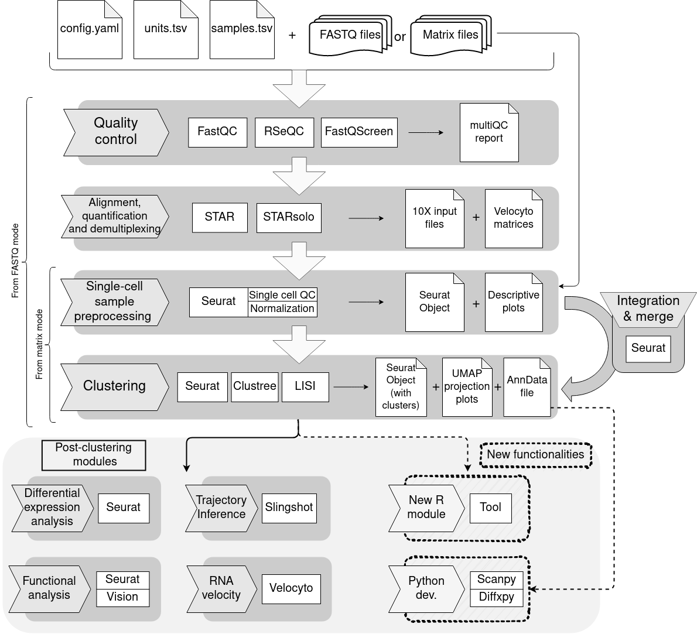

# bollito scRNA-seq pipeline

 [Pipeline status](https://gitlab.com/bu_cnio/bollito/commits/master)

## Introduction
**bollito** is a **[Snakemake](https://snakemake.readthedocs.io/en/stable/) pipeline** that performs a comprehensive single-cell RNA-seq analysis, covering both the basic steps (QC, alignment, quantification and cell specific QC) and more advanced downstream analyses (clustering, diferential expresion, trajectory inference, functional analysis and RNA velocity). 

This pipeline uses state-of-the-art single-cell RNA-seq tools like [Seurat](https://satijalab.org/seurat/), [STARsolo](https://github.com/alexdobin/STAR/blob/master/docs/STARsolo.md), [Vision](https://github.com/yoseflab/VISION), [Slingshot](https://github.com/kstreet13/slingshot), and [Velocyto](http://velocyto.org/). 

The pipeline makes extensive use of Snakemake's integration with the [conda](https://docs.conda.io/en/latest/) package manager and docker/singularity containers, to automatically
take care of software requirements and dependencies.

bollito has two main modes of execution depending on the input data: 
* From **FASTQ**: it accepts FASTQ-formatted raw data (from **drop-seq** or **10X Genomics** experiments).
* From **matrices** including:
    * [Feature-barcode matrices](https://support.10xgenomics.com/single-cell-gene-expression/software/pipelines/latest/output/matrices) (expression matrix format from STARsolo).
    * Standard matrices (cell names and gene names included in the matrix). 

We've built bollito for flexibility, with the aim of allowing the user to adjust the pipeline to different experiments using configuration parameters.
This includes adjusting the cell filtering, normalization, variables regression, number of significant components, clustering resolution, etc.
When in doubt, the default parameters were calculated to offer a good starting configuration.

## Workflow overview

This is a schema of the complete workflow. Certain parts may be skipped depending on input data and chosen configuration.



## Authors
 * Coral Fustero
 * Luis García
 * María José Jiménez
 * Tomás Di Domenico
 
## Setup

The setup of the pipeline consists in the modification of three configuration files, indicating the desired parameters and the location of the input files.
A general description of these files follows. See the *Usage* section for more details.

### Configuration files

* **config.yaml** contains all pipeline parameters.
* **samples.tsv** contains information on the samples to be analysed.
* **units.tsv**: contains information on the different data files associated to the samples to be analysed.

### Input files

* raw data in gzip compressed FASTQ files

or

* matrices of count data
    * **10X**-like input (matrix.mtx + genes.tsv + barcodes.tsv)

    or

    * **standard** tabular format (where rows are genes and columns are cells)

## Usage 

### 1. Set up the environment 

bollito requires the conda package manager in order to work. If you have singularity installed and would rather not install conda,
you can provide the "--use-singularity" option when running the pipeline (see below). Otherwise, please install conda by following
the [bioconda installation instructions](http://bioconda.github.io/user/install.html#install-conda).

### 2. Download bollito repository from Gitlab.
Use git clone command to create a local copy. 

    git clone https://gitlab.com/bu_cnio/bollito.git

### 3. Configure the pipeline.
#### a. samples.tsv
Fill the file with the sample names and the features related to each sample. 

An [example file](https://gitlab.com/bu_cnio/bollito/-/blob/master/samples-example.tsv) is included in the repository.

#### b. units.tsv
* If your input are FASTQ files, for each FASTQ pair input the following data into units.tsv:

| **Column name** 	| **Description**                                         	|
|------------	|-----------------------------------------------------	|
| **sample**     	| Sample name (must match the sample name specified in *samples.tsv*).         	|
| **unit**       	| A distinct name for each pair of files associated to the same sample (for example in the case of replicates). 	|
| **fq1**        	| FASTQ file for read 1, containing the Cell Barcode and UMI.  	|
| **fq2**        	| FASTQ file for read 2, containing the transcriptomic sequence.       	|

An [example file](https://gitlab.com/bu_cnio/bollito/-/blob/master/units-example_fastqs.tsv) is included in the repository.

* If your input are matrix files, for each matrix enter the following data:

| **Parameters**            	| **Description**                                                                                                                                                                                     	|
|-----------------------	|-------------------------------------------------------------------------------------------------------------------------------------------------------------------------------------------------	|
| **sample**                	| Sample name (must match the sample name specified in *samples.tsv*).                                                                                                                                                     	|
| **unit**                  	| Type of input matrix (*10x* or *standard*).                                                                                                                                                         	|
| **matrix**                	| Matrix file (.mtx for 10x or .tsv for standard) storing the counts.                                                                                                                             	|
| **cell_names** (10x only) 	| tsv file containing one cell name per row.                                                                                                                                                      	|
| **gene_names** (10x only) 	| tsv file containing one gene name per row.                                                                                                                                                      	|
| **metadata** (optional) 	| tsv file with two or more columns. First column corresponds to each cell name specified in *cell_names.tsv* and the rest are metadata variables. First row indicates the metadata variable name.       |

An [example file](https://gitlab.com/bu_cnio/bollito/-/blob/master/units-example_matrices.tsv) is included in the repository.

#### c. config.yaml

This is the pipeline configuration file, where you can tune all the available parameters to customise your single-cell analysis.

The [example file](https://gitlab.com/bu_cnio/bollito/-/blob/master/config_example.yaml) features extensive inline documentation.
Here are some of the main available parameters:

|**Parameter** | **Description** |
|--------------|--------------|
|**input_type** |Type of input data (*fastq* or *matrix*).|
|**technology** |Technology used to get the reads files (*10X* or *Drop-seq*).|
|**outdir** |Directory where to store the output files.|
|**logdir** |Directory where to store the log files.|
|**random_seed** |Seed parameter to allow for reproducible analyses.|
|**annotation** |GTF file holding genetic features information.|
|**idx** |Folder containing STAR genomes indexes.|
|**whitelist** |Cell barcodes whitelist file needed for 10x experiments quantification and demultiplexing.|

## Pipeline steps

Here you can find a general description of the main steps of the pipeline.

### 1. FASTQ quality control.

#### General QC

bollito implements [FastQC](https://www.bioinformatics.babraham.ac.uk/projects/fastqc/) to check the overal quality of the input FASTQ files. 

#### Contamination

[FastQ Screen](https://www.bioinformatics.babraham.ac.uk/projects/fastq_screen/) can optionally be enabled in order to check the input FASTQ files for
contaminants.

#### MultiQC report

bollito creates a Quality Control HTML report using [MultiQC](https://multiqc.info/docs/). 
This report includes information from FastQC and RSeQC (which will be explained later). 

### 2. Alignment & quantification.

To obtain the cell expression profiles we need to align the FASTQ files against an annotated reference genome. 
Once we obtain the aligned files, the pipeline assigns the reads to their corresponding cell barcodes, and performs an UMI-based quantification of the annotated features.

The alignment tool implemented in bollito is [STAR](https://github.com/alexdobin/STAR), taking advantage of its
[STARsolo](https://github.com/alexdobin/STAR/blob/master/docs/STARsolo.md) mode for single-cell RNA-seq quantification.

This step requires the following parameters, defined in the configuration file:

* an annotation file containing the features of interest (in GTF format, must match the target genome)
* one of the following options for the genome:
    * a FASTA file (will be indexed by bollito).
    * a STAR genome index.

Example parameters for different STAR configurations are available in the example config file.

### 3. Alignment quality control.

Quality control of the resulting alignments is performed using [RSeQC](http://rseqc.sourceforge.net/).

### 4. Cell quality control, normalization, and dimensionality reduction.

Once the UMI-count matrix is obtained, bollito performs a cell-based quality control.
The purpose of this step is to control for broken cells and doublets, and to analyze the cell cycle status of the cells.
Next, the normalization and dimensionality reduction steps are applied.

Cell quality control, normalization, and dimensionality reduction are implemented using the [Seurat](https://satijalab.org/seurat/) package.

Cell cycle checking is implemented based on molecular signatures from [*Tirosh et al, 2015*](https://genome.cshlp.org/content/25/12/1860.long).

In order to customize this step, the following parameters can be adjusted via the configuration file:

* Minimum and maximum number of detected genes per cell. 
* Minimum and maximum read counts per cell.  
* Minimum ribosomal content.
* Minimum mitochondrial content.
* Normalization method "SCT" ([*(Hafemeister & Satija, 2019)*](https://www.biorxiv.org/content/10.1101/576827v1)) or "standard".

The normalization itself can also be parametrized, including the possibility of regressing the desired variables
(such as cell cycle scoring, number of detected genes, % of mitochondrial genes) in order to mitigate their effect
on the dataset. Refer to the example config file for the available options.

#### 4.b. Integration.

bollito allows for an optional integration step, in order to detect shared cell states between datasets.
The integration method is based on the identification of *anchor cells* between the datasets,
and the projection of datasets on each other by using these *anchors*.
For more information regarding the integration step, please refer to the [Seurat Integration and Label Transfer documentation](https://satijalab.org/seurat/v3.1/integration.html).

Normalization is also available on this step, as described above.

To enable this step, the following parameters need to be adjusted via the configuration file:
* Set *perform* to *TRUE*.
* Specify the normalization method.
* Specify a variable to regress out (optional).

### 5. Clustering.

Clustering of cells uses the normalized expression profiles. 
After, a dimensionality reduction by PCA, the K-nearest-neightbor graphs embedded in this lower dimensional space, are obtained.
Once the graph is created, clusters are captured by using a community detection method.

To explore the clusters along the resolutions, bollito uses [Clustree](https://github.com/lazappi/clustree). Cluster validation is achieved by calculating silhouette scores
for each cluster. 

For this step, the following parameters need to be adjusted via the configuration file:
* Number of significant components based on the elbow plot or JackStraw analysis obtained in previous steps.
* Number of neighbours (*k*) used to generate the KNN graph (optional).
* Resolutions to be used in the community detection method.

### 6. Differential expression analysis.

Differential expression analysis is based on the clusters obtained during the previous step. For each cluster, two analyses are performed:
* Marker gene detection per cluster (for this test, only genes with a logFC threshold of 0.25, that are expressed in at least 10% of the cells are included).
* Differential expression for all genes (no thresholds applied).

Output from this step includes a heatmap of top marker genes per cluster, and a .rnk file that may be used for a downstream gene enrichment analysis with [GSEA](https://www.gsea-msigdb.org/gsea/index.jsp),

The following parameters of this step need to be adjusted via the configuration file:
* Cluster resolution to analyze.
* Differential expression test to apply.

For a list of available tests see the Seurat [FindMarkers](https://rdrr.io/github/satijalab/seurat/man/FindMarkers.html) function documentation.

### 7. Functional analysis.
bollito applies the [Vision](https://github.com/yoseflab/VISION) methodology in order to study
different molecular signatures and their significance at a specific clustering resolution.

To enable this step, the following parameters need to be adjusted via the configuration file:
* Set *perform* to *TRUE*.
* Set the path to the molecular signatures file to use (in .gmt format).
* Select the desired metadata variables from Seurat.
* Set the desired cluster resolution.

### 8. Trajectory inference.

This step analyses the cell lineages of your sample by inferring a pseudotime variable from the data and sorting the clusters according to it. 
The trajectory inference step is implemented by using the [Slingshot](https://github.com/kstreet13/slingshot) package.

To enable it, the following parameters need to be adjusted via the configuration file:
* Set *perform* to *TRUE*.
* Cluster resolution must be specified.
* Specifiy start and end cluster(s) (optional).
* Number of genes for the heatmap representation.
* Number of most variable genes (allows you to generate the general additive model of the heatmap).

### 9. RNA velocity.
The analysis of RNA velocity allows you to capture the expression dynamics of your data by
estimating the spliced and unspliced mRNA abundances on each of the available splicing sites.
Based on this information, future state of single-cells can be inferred.
This step is implemented using the [Velocyto](http://velocyto.org/) wrapper.

To enable this step, the following parameters need to be adjusted via the configuration file:
* Set *perform* to *TRUE*.
* Cluster resolution must be specified.

**Note**: RNA velocity step can not be performed if we use a matrix as input of the pipeline,
since it needs the BAM files to generate the three count matrices (spliced, unspliced and ambiguous).

## Shortcuts
bollito has implemented a shortcut system based on specfic target related to steps. 
Each target calls a end point rule which terminate the pipeline execution.

To use the shorcuts, you only need to run the pipeline as usual, but with the --until option.

    snakemake --use-conda --until target_name

The available targets are:
* **expression_matrix**: run bollito until alignment step included.
* **normalized_expression_matrix**: run bollito until normalization step included.
* **differential_expression**: run bollito until clustering sdifferential expresion steps included.
* **functional_analysis**: run bollito until clustering and functional analysis steps included. 
* **trajectory_inference**: run bollito until clustering and trajectoty inference steps included.
* **geneset_analysis**: run bollito until clustering and geneset analysis steps included.
* **RNA_velocity**: run bollito until clustering and RNA velocity steps included. 

## Report
bollito produces a HTML report using Snakemake automatic report generaration.
This report includes the multiQC report and some quality control and normalization information at single-cell level from Seurat.

To generate the report, you only need to use --report option when the analysis is finished.

    snakemake --report report.html 

## References
* Andrews S. (2010). FastQC: a quality control tool for high throughput sequence data. Available at: <http://www.bioinformatics.babraham.ac.uk/projects/fastqc> [Accessed 13 March 2020]
* Wingett S. (2010). FastQ Screem:FastQ Screen allows you to screen a library of sequences in FastQ format against a set of sequence databases so you can see if the composition of the library matches with what you expect. Available at: <http://www.bioinformatics.babraham.ac.uk/projects/fastq_screen> [Accessed 13 March 2020]
* Dobin, A., Davis, C., Schlesinger, F., Drenkow, J., Zaleski, C., Jha, S., Batut, P., Chaisson, M. and Gingeras, T., 2012. STAR: ultrafast universal RNA-seq aligner. *Bioinformatics*, 29(1), pp.15-21.
* Wang, L., Wang, S. and Li, W., 2012. RSeQC: quality control of RNA-seq experiments. *Bioinformatics*, 28(16), pp.2184-2185.
* Kowalczyk, M., Tirosh, I., Heckl, D., Ebert, B. and Regev, A., 2014. Single cell RNA-Seq of hematopoietic stem cells reveals a cell cycle-dependent interplay between aging and differentiation. *Experimental Hematology*, 42(8), p.S21.
* Stuart, T., Butler, A., Hoffman, P., Hafemeister, C., Papalexi, E., Mauck, W., Hao, Y., Stoeckius, M., Smibert, P. and Satija, R., 2019. Comprehensive Integration of Single-Cell Data. *Cell*, 177(7), pp.1888-1902.e21.
* Hafemeister, C. and Satija, R., 2019. Normalization and variance stabilization of single-cell RNA-seq data using regularized negative binomial regression. *Genome Biology*, 20(1).
* Zappia, L. and Oshlack, A., 2018. Clustering trees: a visualization for evaluating clusterings at multiple resolutions. *GigaScience*, 7(7).
* DeTomaso, D., Jones, M., Subramaniam, M., Ashuach, T., Ye, C. and Yosef, N., 2019. Functional interpretation of single cell similarity maps. *Nature Communications*, 10(1).
* Street, K., Risso, D., Fletcher, R., Das, D., Ngai, J., Yosef, N., Purdom, E. and Dudoit, S., 2018. Slingshot: cell lineage and pseudotime inference for single-cell transcriptomics. *BMC Genomics*, 19(1).
* La Manno, G., Soldatov, R., Zeisel, A., Braun, E., Hochgerner, H., Petukhov, V., Lidschreiber, K., Kastriti, M., Lönnerberg, P., Furlan, A., Fan, J., Borm, L., Liu, Z., van Bruggen, D., Guo, J., He, X., Barker, R., Sundström, E., Castelo-Branco, G., Cramer, P., Adameyko, I., Linnarsson, S. and Kharchenko, P., 2018. RNA velocity of single cells. *Nature*, 560(7719), pp.494-498.

## Test data

The system is pre-configured to run an example based on sample data available from 10X Genomics. The required datasets can be found at these URLS. Please update the "units.tsv" file to point at the data as needed.

* https://support.10xgenomics.com/single-cell-gene-expression/datasets/3.0.0/neuron_10k_v3
* https://support.10xgenomics.com/single-cell-gene-expression/datasets/3.0.0/heart_10k_v3

## FASTQ\_SCREEN

The pipeline can optionally run FASTQ\_SCREEN to check the samples for contamination.

To disable it use the config file option ```config["rules"]["fastq_screen"]["disabled"]```.

Config file pointing to indexes should be placed in a directory named ```config['rules']['fastq_screen_indexes']['outdir']/FastQ_Screen_Genomes```.

If the rule is enabled and no config file provided, default indexes will be downloaded using the command ```fastq_screen --get_genomes```.

___


