# Melanoma tutorial (Ho et al., 2018)
## Tutorial overview

In this tutorial we will analyze the melanoma dataset from *Ho et al*. This dataset is composed by cells from the 451Lu cell line and there are two samples: the parental cell line and a vemurafenib-resistant sample treated with targeted BRAF inhibitors.

The dataset was published by [Ho et al.](https://genome.cshlp.org/content/28/9/1353) and it is available in GEO database under the accession number [GSE108394](https://www.ncbi.nlm.nih.gov/geo/query/acc.cgi?acc=GSE108394). All images in this tutorial have been generated from a downsampled version of the dataset, were only 10 million reads per sample have been considered.

The tutorial will analyse the dataset using the following steps:
- sequencing QC
- single-cell QC
- single-cell normalization
- clustering
- differential expression analysis
- functional analysis.
- trajectory inference analysis.
- RNA velocity analysis.

## Input file configuration

The first step is to download the data we will be analysing. In this case it will be composed of two pairs of paired-end, FASTQ-formatted files.
You should download these files and put them in a directory of your choice. 

We will use the example directory `/my/data/files` throughout the tutorial. You should instead use the real path to your files. Note we have generated an even smaller version or the samples in order to reduce the execution time required to complete the tutorial. 

Parental sample - 451LU:
- [2500K_451LU_L003_R1_001.fastq.gz](https://bioinformatics.cnio.es/data/pipelines/single_cell/10x_sample_data/melanoma_10M/2500K_451LU_L003_R1_001.fastq.gz)
- [2500K_451LU_L003_R2_001.fastq.gz](https://bioinformatics.cnio.es/data/pipelines/single_cell/10x_sample_data/melanoma_10M/2500K_451LU_L003_R2_001.fastq.gz)

Treated sample - 451LUBR3:
- [2500K_451LUBR3_L004_R1_001.fastq.gz](https://bioinformatics.cnio.es/data/pipelines/single_cell/10x_sample_data/melanoma_10M/2500K_451LUBR3_L004_R1_001.fastq.gz)
- [2500K_451LUBR3_L004_R2_001.fastq.gz](https://bioinformatics.cnio.es/data/pipelines/single_cell/10x_sample_data/melanoma_10M/2500K_451LUBR3_L004_R2_001.fastq.gz)

> The files including *R1* (for *read 1*) in ther names store the unique molecular identifiers (UMI) and cell barcodes.
> The files with *R2* (for *read 2*) in their names store the cDNA data.

### Samples file (samples.tsv)
We will now configure the samples file, *samples.tsv*, to adjust it to our data. Since we are dealing with two samples, we will need to enter two lines:

- In the *sample* column we will enter the sample names. In our case, these will be the file names.
- Since the samples can be divided based on the status (parental or treated), we can add a column to define this feature.

Your sample.tsv should look like this:

| sample   | status   | 
| ---------|----------|
| 451LU    | parental |
| 451LUBR3 | treated  |

> TIP: you can add arbitrary columns to the sample.tsv file. These will then be added
> to the output Seurat objects as metadata associated to the sample.

### Units file (units.tsv)
We will now configure the units file, *units.tsv*, to indicate the correspondences between the data and the sample names.

- In the *sample* column we will indicate the sample name (NOTE: this should match the name in *samples.tsv*)
- In the *unit* column we will indicate a unique name to define all the files belonging to the same sample.
In our case, we just have one replicate, so we've decided to name it *r1* to indicate *replicate #1*.
- In the *fq1* column we will indicate the path to the files containing the UMIs and barcodes.
- In the *fq2* column we will indicate the path to the files containing the cDNA data.

Your units.tsv file should look like this:

| sample  | unit | fq1 | fq2 |
| ------- | ---- | ---------- | ----- |
| 451LU   | r1   | /my/data/files/2500K_451LU_L003_R1_001.fastq.gz | /my/data/files/2500K_451LU_L003_R2_001.fastq.gz |
| 451LUBR3   | r1   | /my/data/files/2500K_451LUBR3_L004_R1_001.fastq.gz | /my/data/files/2500K_451LUBR3_L004_R2_001.fastq.gz |

> NOTE: remember to change the file paths to wherever you stored the downloaded fastq files.

### Main configuration file (config.yaml)

Once we have configured our input data, we should configure the resources and parameters
that the pipeline needs in order to correctly process the data. These parameters shouldn't be all configured at once. Instead, users should consider the outputs of each rule in order to correctly set the configuration parameters for the following one. For more information, take a look at the *Pipeline execution recommendations* described in the PBCM tutorial. 

#### Required files

Since the sample we are analysing is from *Homo sapiens*, you will need to download a copy of the human genome sequence, and
the corresponding annotation file:

- [Human genome sequence](ftp://ftp.ebi.ac.uk/pub/databases/gencode/Gencode_human/release_34/GRCh38.primary_assembly.genome.fa.gz)
- [Annotation file](ftp://ftp.ebi.ac.uk/pub/databases/gencode/Gencode_human/release_34/gencode.v34.annotation.gtf.gz)
- [Barcode whitelist file](https://bioinformatics.cnio.es/data/pipelines/single_cell/10x_sample_data/melanoma_10M/737K-august-2016.txt.gz)

> NOTE: You should descompress these files and place them in a directory of your choice. Again, we will use */my/data/files* here.

#### General parameters

The following parameters affect the pipeline as a whole. Use the following table to set the correct values.

| Name               | Value | Notes                                             |
|--------------------|-------|--------------------------------------------------------|
| input_type         | fastq | Input files are FASTQ in fastq format.                                 |
| technology         | 10x   | Input files are generated with 10x Genomics technology. |
| technology_version         | v2   | Input files are generated with 10x Genomics technology. |
| graphics           | True   | Graphic card available. |
| random_seed        | 4848  | A random seed. Using the same seed allows us to have replicable results between pipeline runs.                                  |
| case               | uppercase | Human genes are generally written using upper case letters.              |
| ref-annotation         | /my/data/files/gencode.v35.annotation.gtf | The GENCODE annotation file you just downloaded.  |
| ref-fasta              | /my/data/files/GRCh38.primary_assembly.genome.fa | The GENCODE sequence file you just downloaded.         |
| ref-idx                | /my/data/files/GRCh38.primary_assembly.genome_index  | The path where to store the genome index.                  |
| whitelist          | /my/data/files/737K-august-2016.txt | Barcode whitelist for 10x Chromium v2 chemistry. |

### Step-specific parameters

#### Alignment step - "star"
The STAR alignment parameters are selected depending on the single-cell technology and version. In this case, since the Chromium V2 chemistry was used for sequencing the samples, the system will automatically apply the following STAR parameters:
"--soloType Droplet --soloFeatures Gene Velocyto --outFilterMultimapNmax 50 --winAnchorMultimapNmax 50 --alignEndsType EndToEnd --outReadsUnmapped Fastx --soloUMIlen 12 --outSAMtype BAM SortedByCoordinate --outSAMattributes NH HI nM AS CR UR CB UB GX GN sS sQ sM"

#### Single-cell pre-QC - "seurat_qc"
For the purpose of this tutorial, we have downsampled our data. This operation reduces the number of genes and cells we will be using. Because of this, we will set the required number of cells in which a gene must be detected to just 1.

| Parameter        | Value |  Commentary                                             |
|------------------|-------|---------------------------------------------------------|
| min_cells_per_gene | 1 | Require a gene to be detected in at least 1 cell for it to be included in the analysis |

#### Single-cell post-QC - "seurat_postqc"
In this section we will establish some thresholds for the inclusion and exclusion of cells, based on the results from the seurat_qc rule.

| Name             | Value |  Commentary                                             |
|------------------|-------|---------------------------------------------------------|
| min_feat         | 400   | Bottom limit for the number of expressed genes.         |
| max_feat         | 1700  | Upper limit for the number of expressed genes.          |
| min_count        | null  | Unused filtering.                                       |
| max_count        | null  | Unused filtering.                                       |
| mit_pct          | 12    | Upper limit for the mitochondrial percentage of counts. |
| ribo_pct         | null  | Unused filtering.                                       |

#### Merging - "seurat_merge"

This step merges all samples, generating a combined Seurat object.
The "enable" parameter must be set to true in the configuration file.

| Name             | Value |  Commentary                                             |
|------------------|-------|---------------------------------------------------------|
| enabled         | True   | Merging is perfomed.           |

#### Single-cell normalization - "seurat_normalization"

For the normalization, we have chosen to run the *standard* method. In our case, as the QC parameters (features, counts, mitochondrial percent and ribosomal percent) did not heavily affect the sample, their regression was not needed. The cell cycle was not regressed out either, as it also did not seem to drive the differences in expression between the cells.

| Name             | Value |  Commentary                                             |
|------------------|-------|---------------------------------------------------------|
| normalization         | standard   | Standard normalization method used.           |
| regress_out - enabled | False | Upper limit for the number of expressed genes.          |
| regress_out - vars_to_regress | Empty | Unused filtering.                               |
| regress_cell_cycle    | False | Unused filtering.                                       |
| regress_merge_effect  | False | Upper limit for the mitochondrial percentage of counts. |

#### Integrating - "seurat_integration"

This step integrates all samples through the Seurat integration methodology. The method is able to project one sample over other using a selection of shared cells called *anchors*. We've decided to "enable" this step, to analyze the differences between the merging and the integration steps.
For this purpose, the "enable" parameter must be set to true in the configuration file.

| Name             | Value |  Commentary                                             |
|------------------|-------|---------------------------------------------------------|
| enabled          | True   | Integration is performed. |

#### Single-cell clustering - "seurat_find_clusters"
<<<<<<< HEAD
After taking a look at the elbow plot, we have decided to consider the 1-10 significant PCA components for the clustering analysis. We have also selected a set of resolutions to analyze. The k parameter was set to default. 

| Name                  | Value                   | Commentary                          |
|-----------------------|-------------------------|-------------------------------------|
| principal_components  | 10                      | Significant principal components.  |
| resolutions           | [0.2, 0.4, 0.8, 1.2, 1.6] | Set of tested resolutions.        |
| k_neighbors           | 20                      | Number of *k* neighbors.            |

#### Single-cell functional analysis Seurat-based - "seurat_gs"
In this step, both the path to a GMT file storing molecular signatures (or gene sets) and a threshold value are required.
The threshold value reflects the minimum ratio (expressed genes / total genes) that a gene set needs in order to be considered for testing.
In our case, we have decided to test the whole Hallmarks signature collection, obtained from MSigDB.

| Name             | Value |  Commentary                                             |
|----------------|-------|---------------------------------------------------------|
| enabled         | True   | Set to "True" to execute the analysis.          
| geneset_collection | Hallmarks.gmt | Molecular signatures GMT file.    |
| geneset_percentage  | 0.2 |Minimum ratio (expressed genes / total genes) for a geneset to be tested |

> If you are using the reduced version of the dataset, set the functional analysis to False.

#### Single-cell functional analysis Vision-based - “vision"
After carefully considering our previous results, we decided to focus on the resolution 0.8 for the functional analysis of the samples. 
In this step, we have also tested the Hallmarks signatures, in order to compared the results from both seurat_gs and vision rules.
Also, the metadata variables from the Seurat object were added. The chosen clustering resolution was set to 0.8.

| Name             | Value |  Commentary                                             |
|------------------|-------|---------------------------------------------------------|
| enabled         | True   | Set to "True" to execute the analysis.          |
| mol_signatures  | Hallmarks.gmt | Upper limit for the number of expressed genes.          |
| meta_colums     | ["nCount_RNA", "nFeature_RNA", "percent.mt", "percent.ribo"] | Metadata variables from Seurat. |
| selected_res    | 0.8 | Clustering resolution chosen. |

#### Single-cell differential expression analysis - “seurat_degs“
Since a differential expression analysis is usefulto analyze the data, this step is set to True. We have also decided to focus on the resolution 0.8, for the differential expression analysis between clusters. In this step, the statistical test to use must be specified. In our case, we have decided to apply a Wilcoxon test. The resolution must also be specified. Also, ranking parameter is set to True to obtain the complete differential expression ranking. 

| Name             | Value |  Commentary                                             |
|------------------|-------|---------------------------------------------------------|
| enabled  | True   | Perform differential expression analysis.  |
| selected_cond  | 0.8   | Condition or clustering resolution chosen.  |
| ranking   | True | Create the complete DEG ranking.   |
| test   | "wilcox" | Statistical test to use for the DE analysis.   |

> If you are using the reduced version of the dataset, set the selected_cond to 0.2 as there aren't enough cells to consider all clusters generated at resolution 0.8.

#### Trajectory inference study - "slingshot"

The trajectory inference step needs to be activated by the "enabled" parameter.
Again, the clustering resolution is requested. Also, if the user has a priori information about the lineages,
it can be reflected in the optional parameters: "start_clus" and "end_clus".
Finally, the user must select the number of variable genes (to create the GAM model) and the number of plotted genes to represent in the heatmap.

| Name             | Value |  Commentary                                             |
|------------------|-------|---------------------------------------------------------|
| enabled | True | Activate the step. |
| selected_res | 0.8 | Clustering resolution chosen. |
| start_clus | False | Starting cluster according to previous information. |
| end_clus | False | End clusters according to previous information. |
| n_var_genes | 1000 | Number of genes chosen to create the GAM. |
| n_plotted_genes  | 50 | Number of genes chosen to be repressented in the heatmap. |

#### RNA velocity - “velocyto“

RNA velocity needs to be activated by the "enabled" parameter.
The user needs to specify the clustering resolution of interest and whether to perfom a downsampling or not. In our case, as the test samples have alredy been downsampled, this step won't be needed. But it might be useful when analysing heavier samples. 

| Name             | Value |  Commentary                                             |
|------------------|-------|---------------------------------------------------------|
| enabled | True | Activate the step. |
| selected_res | 0.8 | Clustering resolution chosen. |
| downsampling - enabled | False | Downsampling deactivated. |
| downsampling - n_cells | null | Empty. |

#### Resources per rule specification.

| Rule                        | RAM memory | Threads    |
|-----------------------------|------------|------------|
| star                        | 64000      | 8          | 
| fastqc                      | 8000       | 4          | 
| rseqc_junction_saturation   | 8000       | 1          | 
| rseqc_readdup               | 24000      | 1          | 
| multiqc                     | 8000       | 1          | 
| seurat_qc                   | 3000       | 1          |
| seurat_postqc               | 4000       | 1          |  
| seurat_normalization        | 16000      | 1          |
| seurat_merge                | 16000      | 1          |
| seurat_integration          | 32000      | 1          |
| seurat_find_clusters        | 12000      | 1          | 
| seurat_degs                 | 64000      | 1          | 
| seurat_gs                   | 16000      | 1          | 
| vision                      | 16000      | 1          | 
| slingshot                   | 8000       | 1          | 
| velocyto                    | 32000      | 1          | 

## Execute the pipeline
Once all the input files are ready, the pipeline is executed. The number of available cores is left undefined since it can be adjusted according to the user's computer specfications. The command line used is:

`snakemake --use-conda -j N`

At this point, Snakemake decides the execution order based on the rules' resources specification and triggers the first rules.

## Review the results

In this tutorial, the pipeline will be reviewed step by step, focusing on the main results and the parameter values that need to be specified in the configuration file.

### 1. Sequence QC

In this step, the user will get the **quality control** information at sequence level, produced by FastQC.
This information includes: per base quality, per base sequence content, per base GC-content, duplication levels or adapter content.
The figures represent the quality of the reads (2nd read files) in both samples. What we see in the following plots, is that the quality is good enough, since it is over the red threshold. Because of this, there is no reason to cut the sequences.

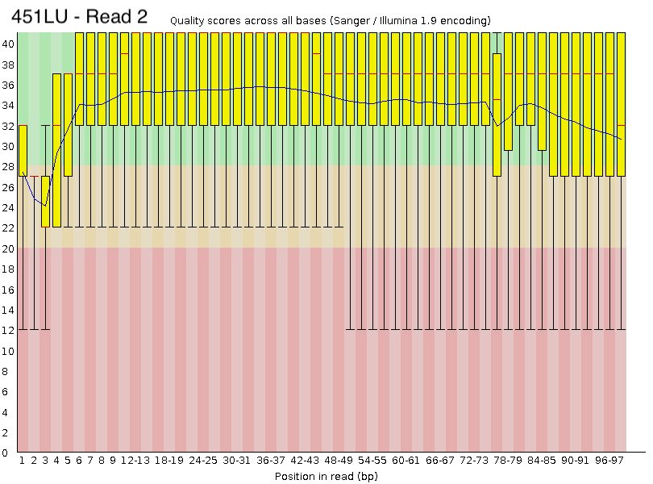 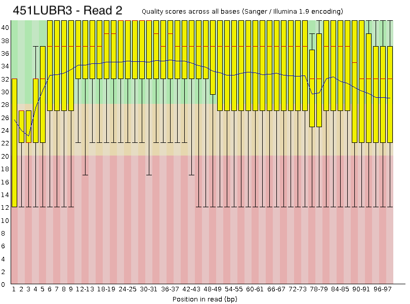

> NOTE: remember to process the FASTQ files if their quality is not good enough.

### 2. Alignment quantification and demultiplexing. 

All these step are carried out by STAR. The user must be careful to choose the **correct alignment parameters**, since an error in this step might not be detected until downstream steps.

The main outputs are:
- BAM file.
- Expression matrix.
- Splicing expression matrix (from Velocyto mode).
- Alignment and quantification summaries.

> NOTE: it is reccomended to check the alignment statistics to detect posible errors. 

### 3. Single-cell QC

Single-cell QC is performed by Seurat and it is divided in two rules:

#### **seurat_qc**: 
In this rule the Seurat object is created from an expression matrix, and it is filtered out twice.
1. CBs expressing less than 200 genes are filtered out, since they might be broken cells or debris.
2. Genes that are expressed in less than *n* CBs are filtered out.
In our case, genes that are not expressed in any cell were also removed (**n** = 1).

> TIP: filtering out genes is recommended when the user wants to reduce the dimensionality of the dataset.

Finally, the rule generates some plots that will allow us to study the quality metrics of the sample.
The most important ones are the four violin plots describing the main QC variables, neccesary for stablishing the seurat_postqc thresholds. 
These thresholds are meant to help the user avoiding both doublets (detected by their high number of counts or features) and broken cells (detected a higher expression of mitochondrial genes).

> NOTE: features refers to genes and viceversa. 

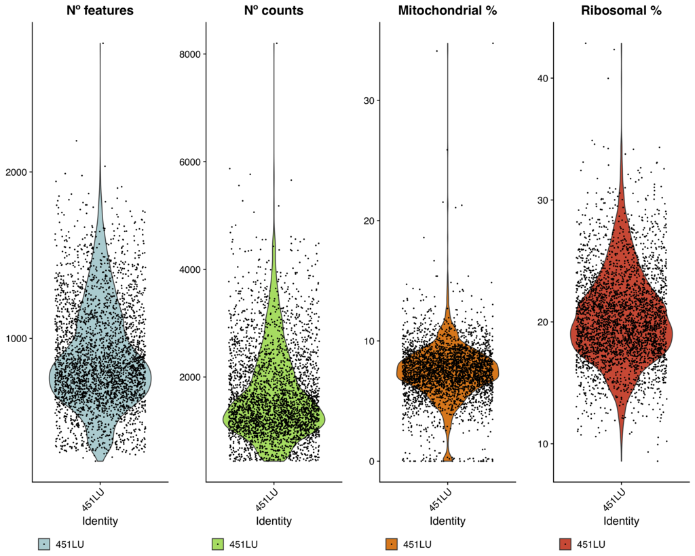

> TIP: a good criteria for establishing thresholds for both features and counts, consist on choosing twice the median of the distribution for the upper threshold and half the median for the bottom threshold.

After carefully examining the violing plots, we need to decide the QC variables to consider for filtering the dataset, 
we also will have to set the thresholds for each of these variables.
In general terms, filtering out by features and by counts is redundant, since they are often correlated. 
To study this correlation is useful to take a look at the "2\_geneplot\_numi\_vs\_pctmit_ngene" plot.

In this case, looking at the 451LU sample results, we have chosen to filter both datasets according to
the number of features (expressed genes) and the mitochondrial percentage:

- The **number of features** thresholds were set to 400 for the bottom limit and 1700 for the upper limit, since the median value was 830.
- The **mitochondrial percentage** upper threshold was set to 12.

These values must be specified in the configuration file ("seurat_postqc" parameters). 

#### **seurat_postqc**: 
This rule filters the dataset according to the previously defined thresholds. It also generates four violin plots showing the distribution of the samples after their filtering. 
The **results** can be observed in the following table.

|         | Number.of.cells | Count.median | Expressed.genes.median | Mitochondrial.percentage.median | Ribosomal.percentage.median |
| ------- | --------------- | ------------ | ---------------------- | ------------------------------- | --------------------------- |
| Pre-QC  | 3296            | 1460         | 831                    | 7.48802955326685                | 19.959914701881             |
| Post-QC | 3073            | 1497         | 842                    | 7.48847926267281                | 19.953325554259             |

> TIP: it is recommended to take a look at the new violin plots and the summary table,
since the applied filtering might be too stringent or too lenient and it could be interesting to repeat the step.

At this point, the filtered **expression matrix** is exported in TSV format.

### 4. Normalization
The dataset was normalized using the **standard method** proposed by Seurat.
This method uses a global-scaling normalization. During this step the sample is also scaled.

A **dimensionality reduction** is performed using a Principal Components Analysis (PCA). In our case, we studied the first 50 components.
To study which of those components is significant, bollito produces both an elbow plot.
The first one shows the variance explained by each component, while the second one shows the significance of each component.

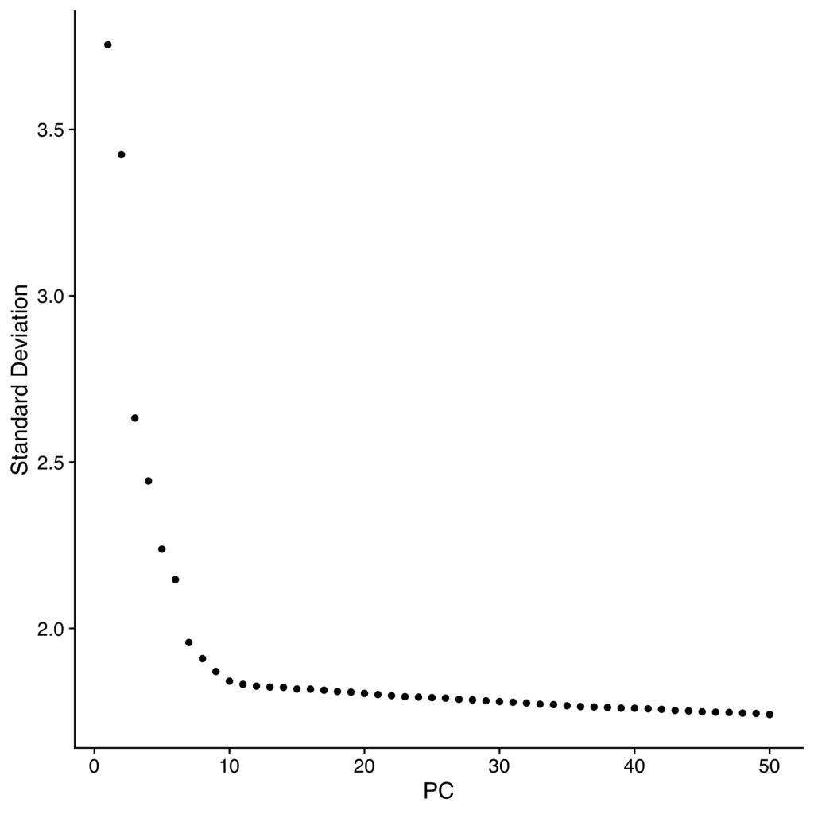 

If we focus on the elbow plot, we can see that the variance starts to be stable at the 10th component.
For this reason, we have selected the first **10 components** to continue with the analysis.
Since these are very few components, the execution time won't be compromised.

> NOTE: the number of significant components chosen in this step is **fundamental** for the following steps of the analysis. 
This parameter does have a high impact in the outcome of the analysis since both the clustering (one of the most important steps) and the visualization, depend directly on it. We recommend to be cautious choosing this value.

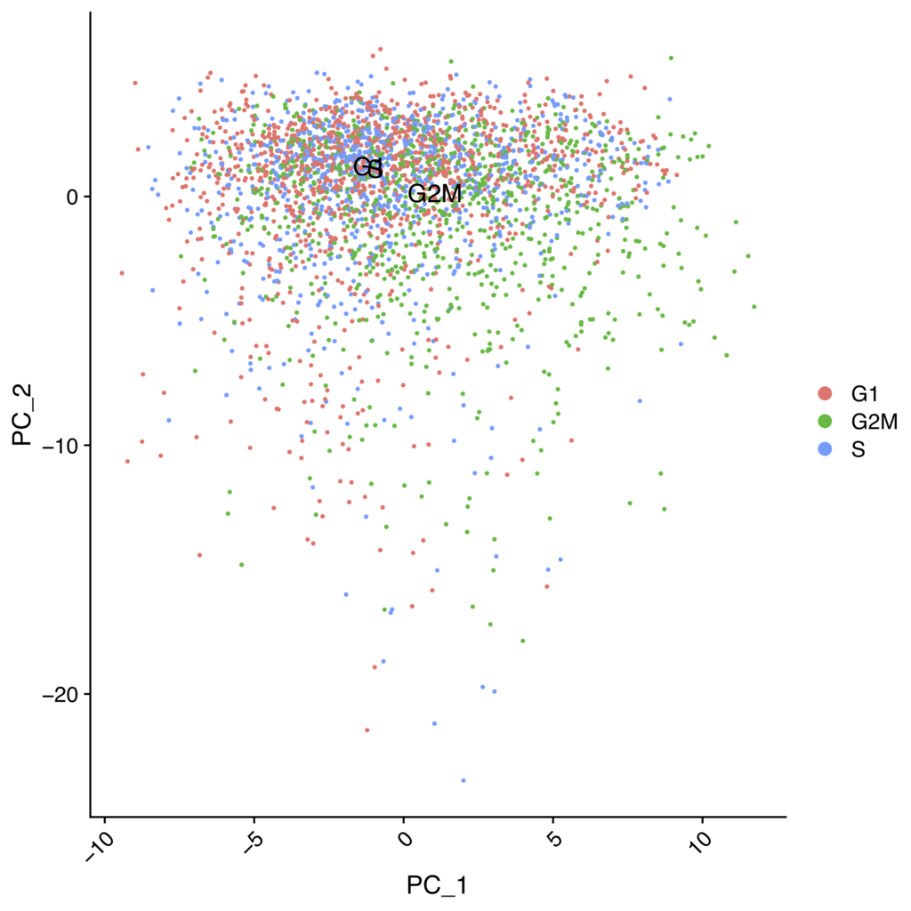

Next, we should check the **cell cycle effect**. 
The plot shows that the sample is not affected by the differences in the cell cycle of the cells, 
since the labels are not clusterized.
Also, it is useful to check the effect of other QC variables (such as the number of counts or detected features), to regress out their effects in case it is neccesary.
In this example, no variable needs to be regressed out, so in the configuration file these fields should be turned to "False" or left empty.

Finally, the normalized **expression matrix** is exported in TSV format.

### 5. Integration and merging

Both methods were used to combine the samples.
On one side, the integration approach removes the technical (although some times, also some of the biological) effect explained by the different conditions. On the other hand, the merging approach, just adds the CBs into a single seurat object, so both the technical and biological effects are kept. 

When comparing both of them: we can see the differences in the separation of the samples depending on the method used. TThe first image, represents the separation between both conditions after the integration, while the second images represents this separation after the merging of the samples. 

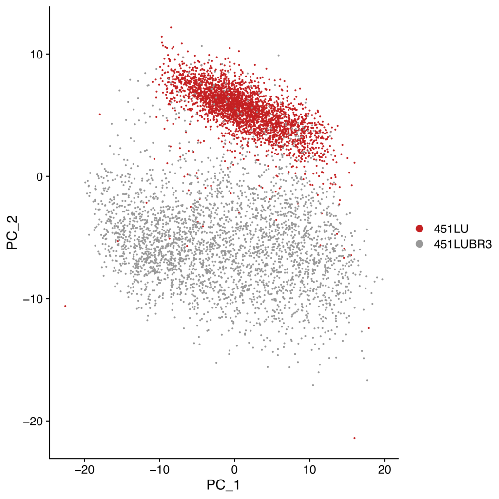
 
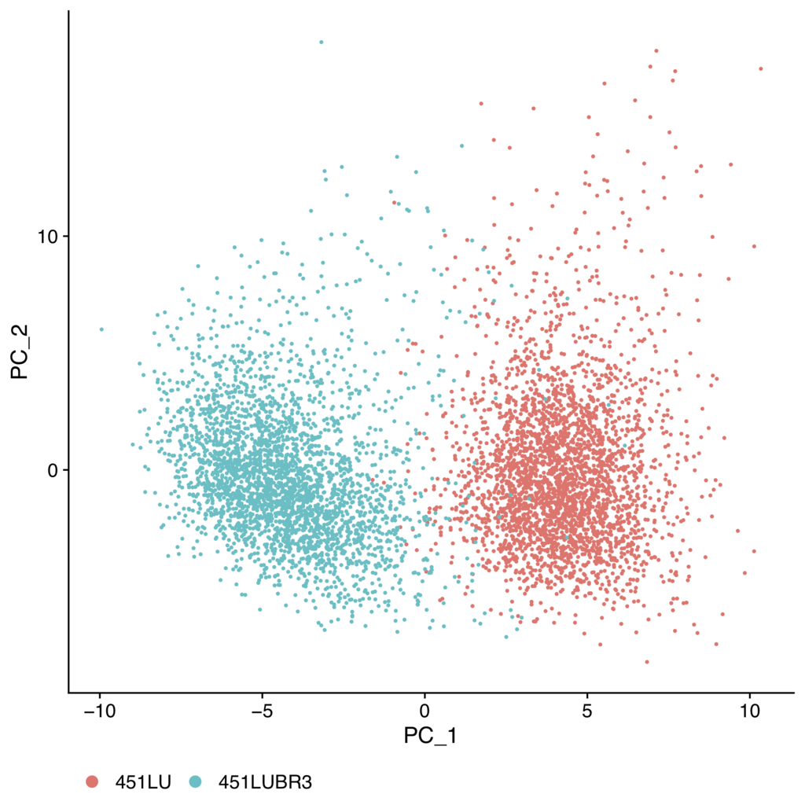

In our case, since the merged object represented correctly the already described bridge effect between both samples (seen in the UMAP),
we decided to continue the analysis using it as input in the following steps.

### 6. Clustering
The clustering methodology is used to find subpopulations of cells within the sample.
This is the central step of the pipeline, since the rest of the analysis steps will depend on its output (the **Seurat clustered object**).

The user needs to set some parameters directly related to the clustering process:
- **Significant principal components**: used to generate the kNN graph and the UMAP dimensions. 
It is usually the number of significant PCs chosen in the previous step --> 10 PCs.
- __*k* parameter__: used to generate the kNN graph. In our analysis the default value was chosen (*k* = 20).
- **Clustering resolution**: these numbers are directly related to the granularity of the clustering analysis or in other words, the number of clusters.
The higher the resolution, the more clusters we obtain.
The analysis can be applied to one or more resolutions. And it is always interesting to check the behaviour of the clustering on (at least) one high and one low resolutions. We decided to chose these resolutions: 0.2, 0.4, 0.8, 1.2 and 1.6.

> TIP: we recommend choosing a range of resolutions according to the number of expected clusters. 

Here, we can see the clusters obtained after applying the analysis for a 0.8 resolution in the merged sample.

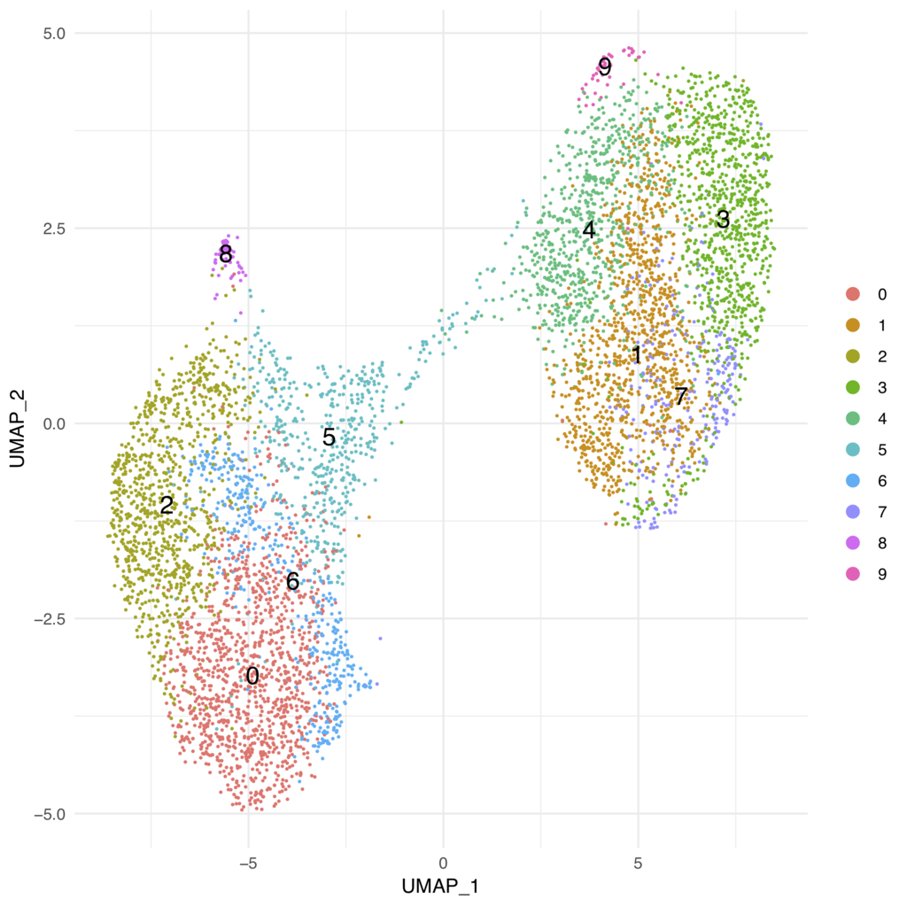

It is important that the user **chooses the resolution of interest** at this point,
since it will be used in later steps (differential expression analysis or functional analysis).

To choose the clustering resolution of interest you should consider:
- Clusters distributions in the UMAP projection.
- Clustering overview provided by the clustree plot.
- **Silhouette score** (a greater score is related with more defined clusters).
- Previuos information of the sample (if you know that the sample is meant to have X functional clusters,
choose the resolution that better adapts to the expected biology).
- Information from downstream analyses (sometimes it is necessary to study serveral resolutions before choosing the one that reflects better the biology of your data).

In our case we decided to choose the **0.8 resolution**,
since analysing too many clusters could have a negative effect in the trajectory inference or the RNA velocity study.

### 7. Diferential expression analysis

This step is **fundamental** to characterize the dataset. 
Here, the expression profile of each cluster (or condition) is compared to the rest,
obtaining the **marker genes** per cluster (filtered by logFC, and a minimum number of cells expressing each gene), but also a complete differential expression analysis including all the genes of the dataset.
The marker genes are a valuable information since they will be useful for the functional characterization of the clusters.

The users should study the clusters of interestest. In our case, we have focused on the cluster 5, since it corresponds to the bridge between both samples. To do some bibliographic research of the detected marker genes can be really valuable for the functional characterization of the cells.

For example:
- *SERPINE2* a high expression of this gene, has been identified in aggresive melanoma cells. In our case this gene might be an indicator of resistance to the treatment.
- *FN1* expression is correlated to proliferation and metastasis, which can be also related to more resistance. 

|           | p_val                 | avg_logFC         | pct.1 | pct.2 | p_val_adj             |
| --------- | --------------------- | ----------------- | ----- | ----- | --------------------- |
| SERPINE2  | 3.29185734866496e-165 | 1.79420761703473  | 0.8   | 0.341 | 6.77464242355249e-161 |
| FN1       | 1.76067582153829e-148 | 1.48386480655715  | 0.515 | 0.119 | 3.6234708407258e-144  |
| TNFRSF12A | 6.20188035797363e-142 | 1.20137179512181  | 0.775 | 0.322 | 1.27634697767097e-137 |
| MT2A      | 8.23288233599758e-139 | 1.20418784974103  | 0.964 | 0.802 | 1.6943271847483e-134  |
| GAPDH     | 5.13836798411217e-135 | 0.714110484192048 | 1     | 0.989 | 1.05747613113028e-130 |
| PRNP      | 1.15681138051797e-115 | 1.33522305795223  | 0.515 | 0.148 | 2.38071782110598e-111 |
| CCND1     | 1.07565991347884e-106 | 1.0934525440879   | 0.866 | 0.514 | 2.21370810193944e-102 |
| IER3      | 6.03730672969721e-86  | 1.04700173312741  | 0.564 | 0.217 | 1.24247772497169e-81  |
| S100A10   | 9.99501534946201e-86  | 1.00261489881903  | 0.8   | 0.544 | 2.05697415891928e-81  |
| TMSB10    | 4.27072264914829e-83  | 0.663665250851741 | 0.985 | 0.956 | 8.78914721194718e-79  |

> TIP: we recommend to study more than one or two marker genes before
classifyng a cluster as a specific cell type or subtype.

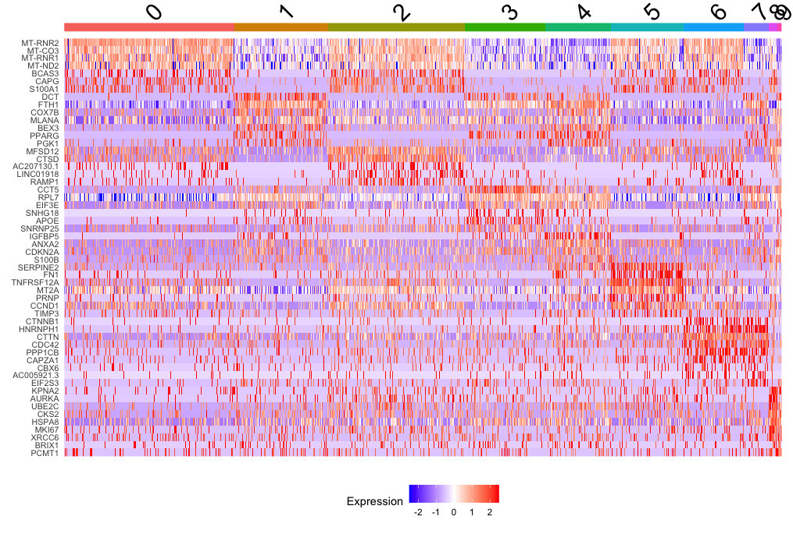 

### 8. Functional analysis - Seurat-based

This step uses **molecular signatures** to study the dataset. This approach can help us in the characterization and classification of the clusters and cells according to the functions they are carrying out or their expression in different conditions.

In this step, three main plots are generated:
- A feature plot showing the **mean expression** of the signature per **cell**.
- A clustree plot showing the **mean expression** of the signature per **cluster**.
- A clustree plot showing the **significance** of each analyzed function based on their differences in mean expression.

The user should take into account these three plots to hypothesize about the functional meaning of the identified clusters. We also recommend to confirm your conclusions using other methodologies (included in the following steps of the analysis).

> NOTE: keep in mind that the clustree significance is generated by comparing 1 cluster vs the rest,
so it is **difficult** for a signature to be significant if it is expressed equally in different clusters.

In this tutorial, we have studied the Hallmarks collection of molecular signatures from MSigDB.
One of the most interesting results was generated by the Epithelial-Mesenchymal Transtion signature.
The signature was more expressed in cluster 5 (the bridge between samples) and it was highly significant as well.
This supports our previous conclusions, indicating that the cluster 5 is composed by more aggresive and resistant cells.

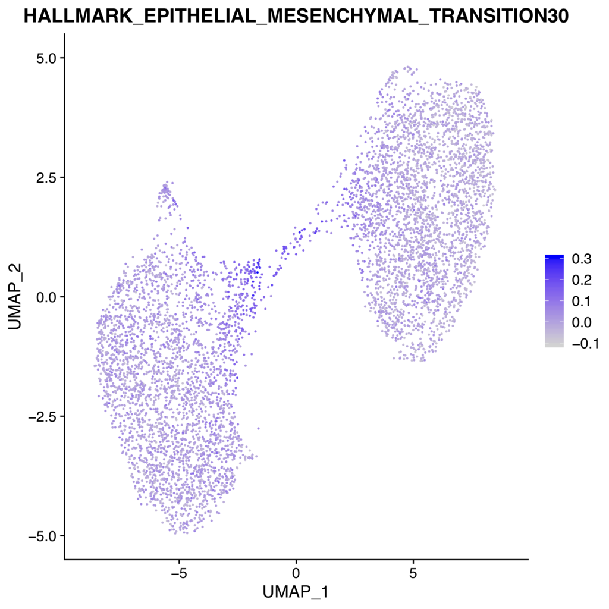 

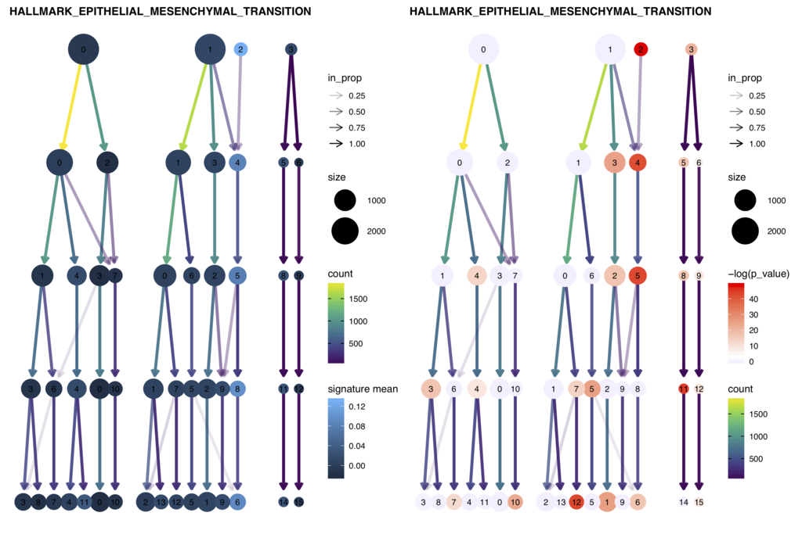 

> NOTE: remember that these clustree plots show the clusters along the different analyzed resolutions.
Each circle is a cluster, which has different colours and sizes according to the mean expression and cluster size respectively.
Each resolution is represented in a different row, ordered from the lower (upper row) to the higher resolutions (bottom row).
Finally, the transitions between clustering resolutions are represented with arrows. 

### 9. Functional analysis - Vision-based

This step also takes advantage of distinct **molecular signatures** to study the dataset,
but it uses the Vision tool as the approach to do so.
This tool calculates a score called "Vision score" which represents the molecular signature's expression level.
The higher the score, the more expressed the signature is. The significance of this score is calculated using the Geary C Statistics method,
which measures the autocorrelation between cells.
If cells in close proximity have a high Vision score compared to the rest of the cells, the molecular signature will be significant.
When a molecular signature is significant (at the chosen resolution), bollito will create a plot representing the Vision scores of each cell in the UMAP.

In this case the user will just have to select:
- Set of **molecular signatures** to be tested.
- The **clustering resolution** in which the signatures should be studied.
- The **Metadata variables** from the Seurat object that could be interesting to include in the analysis.

For this step, we have also tested the Hallmarks molecular signatures, in order to give us a wider understanding of the sample and to compare the results to those obtained in the previous step.
Here we show the Epithelial-Mesenchymal Transition score using the Vision tool.

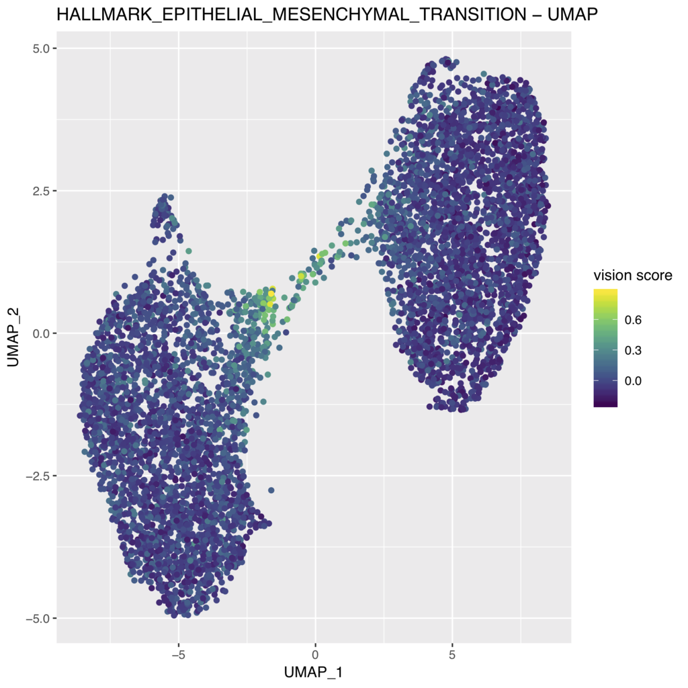 

### 10. Trajectory inference

bollito uses Slingshot to calculate the lineages and pseudotime of the sample. 
This tool uses the Simultaneous Principal Curves methodology to compute the trajectories within the clusters.
If the user has previous information about the lineages, the starting clusters and the ending clusters can be defined in the configuration file.

In our case we did not select any ending or starting point, and multiples lineages were obtained. 
We can see that the bridge cluster between samples is a common point between all lineages,
since those cells are expected to be the transition between both states

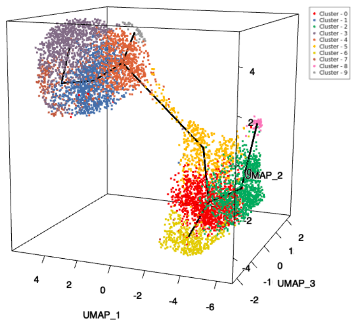 

### 11. RNA velocity

This step is performed using the SeuratWrappers package that calls Velocyto.R.
The RNA molecular dynamics of the cells are defined by the splicing information: calculating both the RNA splicing and degradation rates.
Once the model is calculated, the RNA velocity vectors are projected over the cells in the UMAP dimensions.

In this case the plot shows how the bridge is an unstable zone. Since the vectors are pointing at it, this suggest that the cells in this dataset go through a transitional state. The method does not describe the direction of the transition.

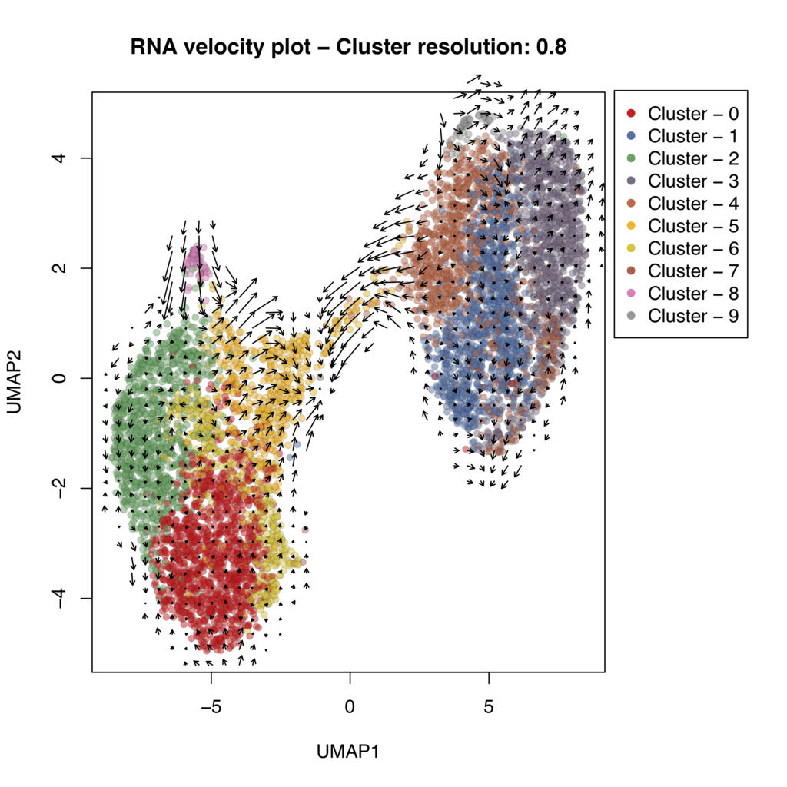 

