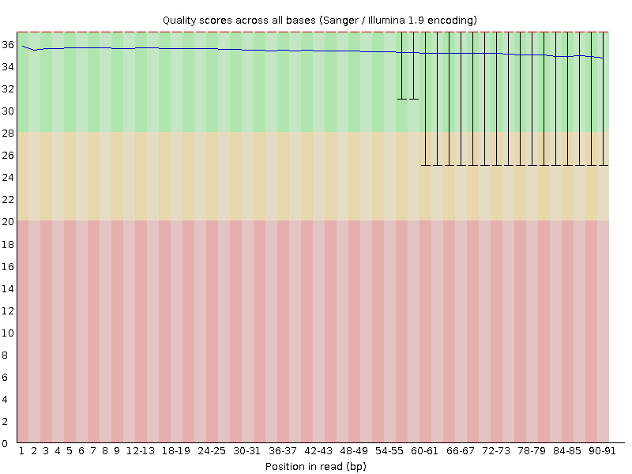
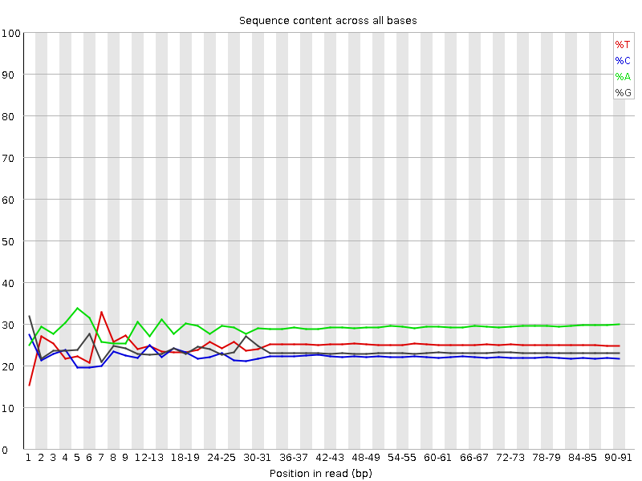
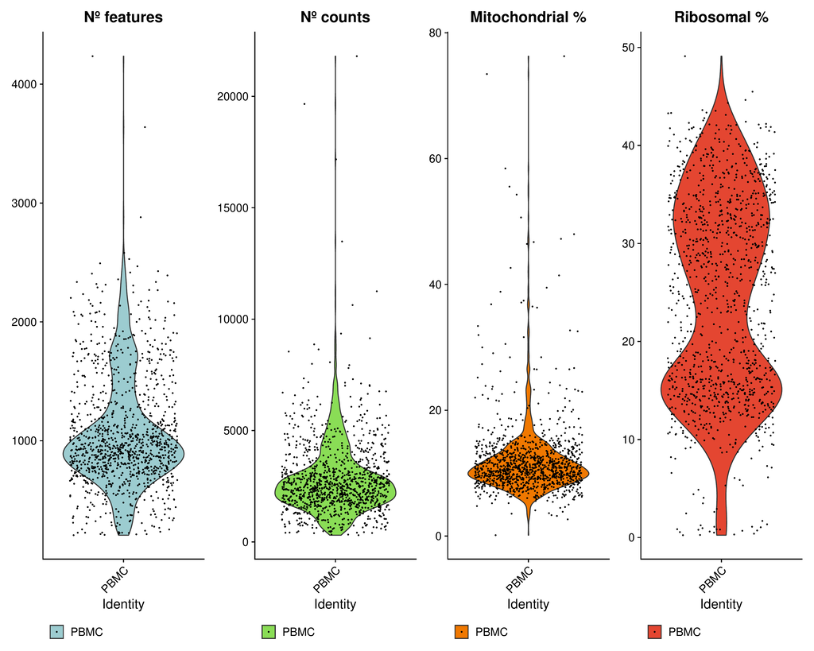
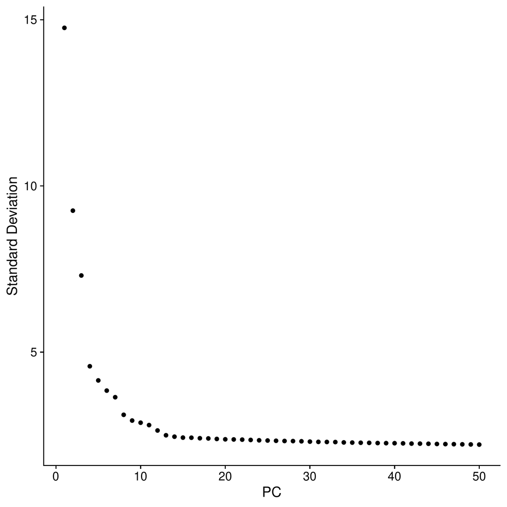
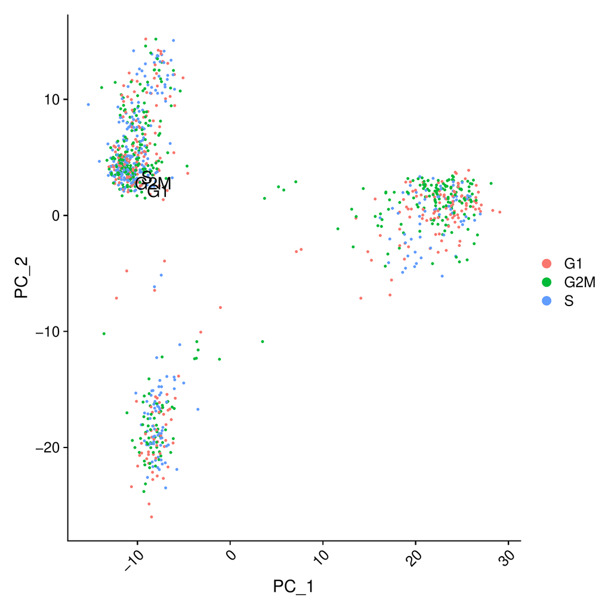
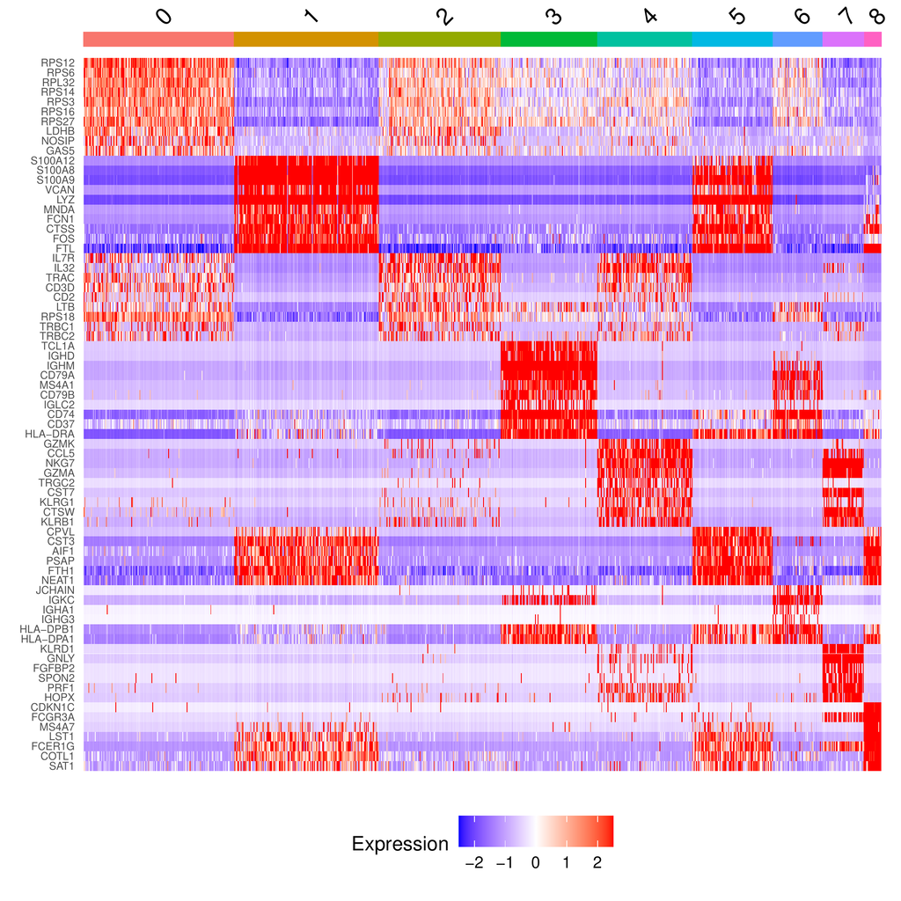
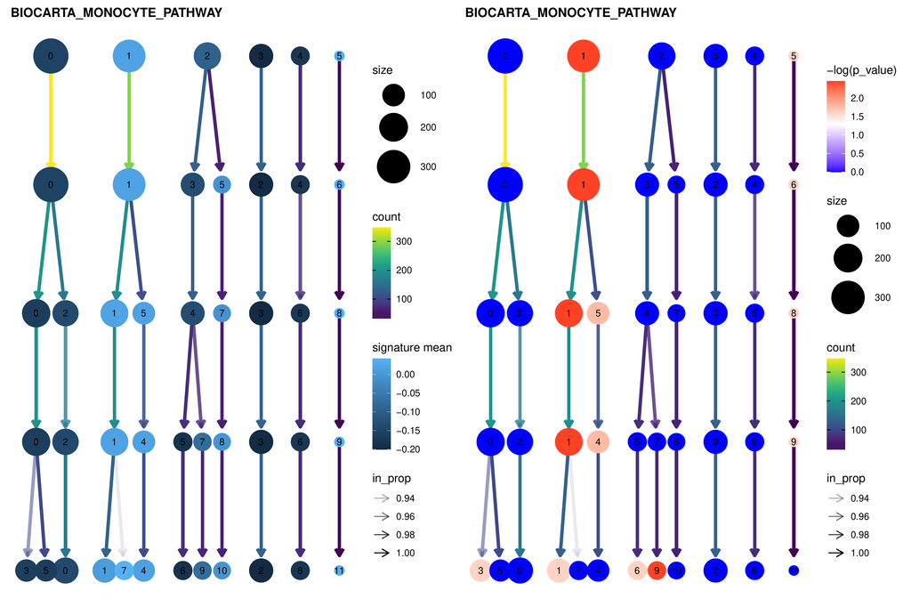

# PBMC tutorial
## Tutorial overview

In this tutorial we will analyze the *PBMC* dataset. This dataset is composed of various types of *human* blood cells including T cells, B cells, NK cells, and monocytes.

The sample is part of [10x Genomics example datasets](https://support.10xgenomics.com/single-cell-gene-expression/datasets). In this case the dataset has been
downsampled to 1 million reads in order to reduce the execution time required to complete the tutorial.

The tutorial will analyse the dataset using the following steps:
- sequencing QC
- single-cell QC
- single-cell normalization
- clustering
- differential expression analysis
- functional analysis.

## Input file configuration

The first step is to download the data we will be analysing. In this case it will be composed of two pairs of paired-end, FASTQ-formatted files.

You should download these files and put them in a directory of your choice. We will use the example directory `/my/data/files` throughout the tutorial. You should instead use the real path to your files.

First pair of files, corresponding to lane 1 of the flowcell:
- [5M_pbmc_1k_v3_S1_L001_R1_001.fastq.gz](https://bioinformatics.cnio.es/data/pipelines/single_cell/10x_sample_data/pbmc_5M/5M_pbmc_1k_v3_S1_L001_R1_001.fastq.gz)
- [5M_pbmc_1k_v3_S1_L001_R2_001.fastq.gz](https://bioinformatics.cnio.es/data/pipelines/single_cell/10x_sample_data/pbmc_5M/5M_pbmc_1k_v3_S1_L001_R2_001.fastq.gz)

Second pair of files, corresponding to lane 2 of the flowcell:
- [5M_pbmc_1k_v3_S1_L002_R1_001.fastq.gz](https://bioinformatics.cnio.es/data/pipelines/single_cell/10x_sample_data/pbmc_5M/5M_pbmc_1k_v3_S1_L002_R1_001.fastq.gz)
- [5M_pbmc_1k_v3_S1_L002_R2_001.fastq.gz](https://bioinformatics.cnio.es/data/pipelines/single_cell/10x_sample_data/pbmc_5M/5M_pbmc_1k_v3_S1_L002_R2_001.fastq.gz)

> The files with *R1* (for *read 1*) in their names store the unique molecular identifiers (UMI) and the cell barcodes.
> The files with *R2* (for *read 2*) in their names store the cDNA data.

### Samples file (samples.tsv)
We will now configure the samples file, *samples.tsv*, to adjust it to our data. Since we are dealing with a single sample, we will only need a single line:

- In the *sample* column we will enter the sample name. We will use the name of the dataset, *PBMC*.

Your sample.tsv should look like this:

| sample |
| ------ |
| PBMC   |

> TIP: you can add arbitrary columns to the sample.tsv file. These will then be added
> to the output Seurat objects as metadata associated to the sample.

### Units file (units.tsv)
We will now configure the units file, *units.tsv*, to indicate which data files belong to each sample.

- In the *sample* column we will indicate the sample name (NOTE: this should match the name in *samples.tsv*)
- In the *unit* column we will indicate a unique name for each set of files that belong to the same sample.
Let's use *l1* and *l2* to indicate thay they come from different lanes.
- In the *fq1* column we will indicate the path to our file containing the UMIs and barcodes.
- In the *fq2* column we will indicate the path to our file containing the cDNA data.

Your units.tsv file should look like this:

| sample | unit | fq1 | fq2 |
| ------ | ---- | ---------- | ----- |
| PBMC   | l1   | /my/data/files/5M_pbmc_1k_v3_S1_L001_R1_001.fastq.gz      | /my/data/files/5M_pbmc_1k_v3_S1_L001_R2_001.fastq.gz |
| PBMC   | l2   | /my/data/files/5M_pbmc_1k_v3_S1_L002_R1_001.fastq.gz      | /my/data/files/5M_pbmc_1k_v3_S1_L002_R2_001.fastq.gz |

> NOTE: remember to change the file paths to wherever you stored the downloaded fastq files.

### Main configuration file (config.yaml)

Once we have configured our input data, we should configure the resources and parameters
that the pipeline needs in order to correctly process the data. These parameters shouldn't be all configured at once. Instead, users should consider the outputs of each rule in order to correctly set the configuration parameters for the following one. 

#### Required files

Since the sample we are analysing is from *Homo sapiens*, you will need to download a copy of the human genome sequence, and
the corresponding annotation file:

- [Human genome sequence](ftp://ftp.ebi.ac.uk/pub/databases/gencode/Gencode_human/release_34/GRCh38.primary_assembly.genome.fa.gz)
- [Annotation file](ftp://ftp.ebi.ac.uk/pub/databases/gencode/Gencode_human/release_34/gencode.v34.annotation.gtf.gz)
- [Barcode whitelist file](https://bioinformatics.cnio.es/data/pipelines/single_cell/10x_sample_data/pbmc_1M/3M-february-2018.txt.gz)

> NOTE: you should descompress these files and place them in a directory of your choice. Again, we will use */my/data/files* here.

#### General parameters

The following parameters affect the pipeline as a whole. Use the following table to set the correct values.

| Name               | Value | Notes                                             |
|--------------------|-------|--------------------------------------------------------|
| input_type         | fastq | Input files are FASTQ in fastq format.                                 |
| technology         | 10x   | Input files are generated with 10x Genomics technology. |
| case               | uppercase | Human genes are generally written using upper case letters.              |
| random_seed        | 4848  | A random seed. Using the same seed allows us to have replicable results between pipeline runs.                                  |
| annotation         | /my/data/files/gencode.v34.annotation.gtf | The GENCODE annotation file you just downloaded.  |
| fasta              | /my/data/files/GRCh38.primary_assembly.genome.fa | The GENCODE sequence file you just downloaded.         |
| idx                | /my/data/files/GRCh38.primary_assembly.genome_index  | The path where to store the genome index.                  |
| whitelist           | /my/data/files/3M-February-2018.txt | Barcode whitelist for 10x Chromium v3 chemistry. |

### Step-specific parameters

#### Alignment step (star)
The STAR alignment parameters are selected depending on the single-cell technology and version. In this case, since the Chromium V3 chemistry was used for sequencing the samples, the system will automatically apply the following STAR parameters:
"--soloType Droplet --soloFeatures Gene Velocyto --outFilterMultimapNmax 50 --winAnchorMultimapNmax 50 --alignEndsType EndToEnd --outReadsUnmapped Fastx --soloUMIlen 12 --outSAMtype BAM SortedByCoordinate --outSAMattributes NH HI nM AS CR UR CB UB GX GN sS sQ sM"

#### Single-cell pre-QC (seurat_qc)
For the purpose of this tutorial, we have downsampled our data. This operation reduces the number of genes and cells we will be using. Because of this, we will set the required number of cells in which a gene must be detected to just 1.

| Parameter        | Value |  Commentary                                             |
|------------------|-------|---------------------------------------------------------|
| min_cells_per_gene | 1 | Require a gene to be detected in at least 1 cell for it to be included in the analysis |

#### Single-cell post-QC (seurat_postqc)
In this section we will establish some thresholds for the inclusion and exclusion of cells, based on the results from the seurat_qc rule.

| Name             | Value |  Commentary                                             |
|------------------|-------|---------------------------------------------------------|
| min_feat         | 400  | Bottom limit for the number of expressed genes.         |
| max_feat         | 2000  | Upper limit for the number of expressed genes.          |
| mit_pct          | 18    | Upper limit for the mitochondrial percentage of counts. |

#### Single-cell normalization (seurat_normalization)

The normalization method chosen was SCT. The QC parameters (features, counts, mitochondrial percent and ribosomal percent)
did not heavily affect the sample, so their regression was not needed. The cell cycle was not regressed out either, as it also did not seem to drive the differences in expression between the cells.

| Name             | Value |  Commentary                                             |
|------------------|-------|---------------------------------------------------------|
| normalization         | SCT   | SCT method           |
| regress_out           | False | Upper limit for the number of expressed genes.          |
| vars_to_regress       | Empty | Unused filtering.                                       |
| regress_cell_cycle    | Empty | Unused filtering.                                       |
| regress_merge_effect  | Empty | Upper limit for the mitochondrial percentage of counts. |

#### Single-cell clustering - “seurat_clustering“
After taking a look at the elbow and jack-stat plots (outputs from the previous rule), we selected the 1-7 significant PCA components. 
We also selected a set of resolutions to analyze. The k parameter was set to default. 

| Name                  | Value                   | Commentary                          |
|-----------------------|-------------------------|-------------------------------------|
| principal_components  | 7                       | Significant principal components.   |
| resolutions           | [0.2, 0.4, 0.8, 1.2, 1.6] | Set of tested resolutions.          |
| k_neighbors           | 20                      | Number of *k* neighbors.            |

#### Single-cell functional analysis Seurat-based - “seurat_gs“
In this step, both the path to a GMT file storing the molecular signatures and a threshold value are required.
The threshold value reflects the minimum ratio (expressed genes / total genes) for a geneset to be tested.
In this case, some PBMC related signatures were tested.

| Name             | Value |  Commentary                                             |
|----------------|-------|---------------------------------------------------------|
| geneset_collection  | PBMC_related_msigs.gmt   | Molecular signatures GMT file.    |
| geneset_percentage  | 0.2 |Minimum ratio (expressed genes / total genes) for a geneset to be tested |

#### Single-cell functional analysis Vision-based - “vision“
To obtain a wider explanation of the functional characteristics of our  sample, we decided to test the Hallmarks signatures from MSigDB.
Also, the metadata variables from the Seurat object were added and the chosen clustering resolution was set to 0.4.

| Name             | Value |  Commentary                                             |
|------------------|-------|---------------------------------------------------------|
| perform         | True   | Set to "True" to execute the analysis.          |
| mol_signatures  | Hallmarks.gmt | Upper limit for the number of expressed genes.          |
| meta_colums     | ["nCount_RNA", "nFeature_RNA", "percent.mt", "percent.ribo"] | Metadata variables from Seurat. |
| n_cores         | 8 | Threads provided to Vision.                                      |
| selected_res    | 0.8 | Clustering resolution chosen. |

#### Single-cell differential expression analysis - “seurat_degs“
We have also decided to focus on the resolution 0.4, for the differential expression analysis between clusters. For the differential expression analysis step, the statistical test must be specified. In our case, we decided to apply a  Wilcoxon test. The resolution must also be specified.

| Name             | Value |  Commentary                                             |
|------------------|-------|---------------------------------------------------------|
| selected_res  | 0.8   | Clustering resolution chosen.  |
| test   | "wilcox" | Statistical test to use for the DE analysis   |

#### Resources per rule specification.

| Rule                        | RAM memory | Threads    |
|-----------------------------|------------|------------|
| star                        | 64000      | 8          | 
| fastqc                      | 8000       | 4          | 
| rseqc_junction_saturation   | 8000       | 1          | 
| rseqc_readdup               | 24000      | 1          | 
| multiqc                     | 8000       | 1          | 
| seurat_qc                   | 3000       | 1          |
| seurat_postqc               | 4000       | 1          |  
| seurat_normalization        | 16000      | 4          |
| seurat_find_clusters        | 8000       | 4          | 
| seurat_degs                 | 64000      | 4          | 
| seurat_gs                   | 16000      | 1          | 
| vision                      | 16000      | 8          | 

## Execute the pipeline
Once all the input files are ready, the pipeline is executed.
The number of available cores is left undefined since it can be adjusted according to the user's computer specfications.
The command line used is:

`snakemake --use-conda -j N`

At this point, Snakemake decides the execution order based on the rules resources specification and triggers the first rules.

### Pipeline execution recommendation.
The pipeline requires its execution at least two times (three recommended). It is recommended to set the parameters according to the results obtained in previous steps when needed.

1. **First execution - Single-cell QC filtering parameters**:
A first execution would allow us setting the values for the filtering rule "seurat_postqc".
Once the pipeline has completed both the "seurat_preqc" and the "seurat_postqc" steps, the user should take a look at the QC plots and choose the proper filtering values (later explained).
After setting these filters in the configuration file, the user should remove the previous seurat_postqc outputs (just the ones found in these specific folders) in order to repeat the single-cell QC. In order to run the pipeline until the normalization step we use the "until" parameter from Snakemake.

`snakemake --use-conda -j N --until normalized_expression_matrix`

2. **Second execution - Single-cell normalization parameters parameters**: 
A second execution would allow us studying the significance of the principal components of the PCA, and the cell cycle effect.
It is also recommended to check the effect of other QC variables such as the differences in the number of features or counts.
Once the user has decided the number of significant components to include in the analysis and the variables to be regressed out (if any),
these values should be set in the configuration file.
Following the indications defined in the previous section, the user must remove the output files in the normalization folder, in order to repeat the step (if needed).
To run the pipeline only until the normalization step, we use the "until" parameter from Snakemake.

`snakemake --use-conda -j N --until normalized_expression_matrix`

3. **Third execution - Clustering resolution selection and final execution**: 
With the third execution, the user will study the clustering results and decide the clustering resolution to use in the following steps.
Once, the UMAPs, silhouette scores and clustree plots are analysed. The clustering resolution of interest should be set in the configuration file.
To run the pipeline we use the following command: 

`snakemake --use-conda -j N`

> NOTE: remember to stop the execution when the clustering step is finished and resume it when the changes in the configuration file are prepared.

## Review the results

In this tutorial, the pipeline will be reviewed step by step,
focusing on the main results and the parameter values that need to be specified in the configuration file.

### 1. Sequence QC

In this step, the user will get the **quality control** information at sequence level produced by FastQC.
This information includes: per base quality, per base sequence content, per base GC-content, duplication levels or adapter content.
As we can see in the figures, the sequence quality is fine (quality score = 37) (right figure),
but the higher content of A-T bases could mean the presence of poli-A tails (left figure).

 

> NOTE: remember to process the FASTQ files if their quality is not good enough.

### 2. Alignment quantification and demultiplexing. 

All these steps are carried out by STAR.
The user must be careful to choose the **correct parameters** (technology and chemistry), since an error in this step might not be detected until downstream steps.

The main outputs are:
- BAM file.
- Expression matrix.
- Splicing expression matrix (from Velocyto mode).
- Alignment and quantification summaries.

It is reccomended to check the alignment statistics to detect posible errors. 

### 3. Single-cell QC

Single-cell QC is performed by Seurat and it is divided in two rules:

#### **seurat_qc**: 
In this rule, a Seurat object is created from the expression matrix, and it is filtered out twice.
1. CBs expressing less than 200 genes are filtered out, since they might be broken cells or debris.
2. Genes that are expressed in less than *n* CBs are filtered out.
In our case, genes that are not expressed in any cells were also removed (**n** = 1).

> TIP: Filtering out genes is recommended when the user wants to reduce the dimensionality of the dataset.

Finally, the rule generates some plots that will allow us to study the quality metrics of the sample.
The most important ones are the four violin plots describing the main QC variables, neccesary for stablishing the seurat_postqc thresholds. 
These thresholds are meant to help the user avoiding both doublets (detected by their high number of counts or features) and broken cells (detected a higher expression of mitochondrial genes).

> NOTE: features refers to genes and viceversa. 

> TIP:  A good criteria for establishing the thresholds for both the features and the counts, consists on choosing twice the 
median of the distribution for the upper threshold and half the median for the bottom threshold.

After carefully examining the violing plots, we need to decide the QC variables to consider for filtering the dataset, 
we also will have to set the thresholds for each of these variables.
In general terms, filtering out by features and by counts is redundant, since they are often correlated. 
To study this correlation is useful to take a look at the "2\_geneplot\_numi\_vs\_pctmit_ngene" plot.

In this case, we have chosen to filter both datasets according to
the number of features (expressed genes) and the mitochondrial percentage:

- The **number of features** thresholds were set to 400 for the bottom limit and 2000 for the upper limit.
- The **mitochondrial percentage** upper threshold was set to 18.

These values must be specified in the configuration file ("seurat_postqc" parameters). 

#### **seurat_postqc**: 
This rule filters the dataset according to the previously defined thresholds.
The **results** can be observed in the following table.

|         | Number.of.cells | Count median | Expressed genes median | Mitochondrial percentage median | Ribosomal percentage median |
| ------- | --------------- | ------------ | ---------------------- | ------------------------------- | --------------------------- |
| Pre-QC  | 1158            | 2477         | 949                    | 10.7102532951626                | 24.8831836277771            |
| Post-QC | 1006            | 2521         | 958                    | 10.5033238004125                | 27.5509204415016            |

> TIP: it is recommended to take a look at the new violin plots and the summary table,
since the filtering might be too stringent or too lenient and it could be interesting to repeat the step.

At this point, the filtered **expression matrix** is exported in TSV format.

### 4. Normalization
The dataset was normalized using the **SCT method** developed by Seurat's team.
This method aims to remove the technical effect while keeping the biological meaning of the sample. During this step, the sample is also scaled.

A **dimensionality reduction** is performed using a Principal Components Analysis (PCA). In our case, we studied the first 50 components.
To study which of those components is significant, bollito produces both an elbow plot and a JackStraw plot.
The first one shows the variance explained by each component, while the second one shows the significance of each component.

 

From the JackStraw plot, we have observed that the 6th component is the last significant one.
But if we focus on the elbow plot, we can see that the variance starts to be stable at the 7th component.
For this reason, we prefer to be conservative and keep the first **7 components**.
Since these are very few components, the execution time won't be compromised.

> NOTE: the number of significant components chosen in this step is **fundamental** for the following steps of the analysis. 
This parameter does have a high impact in the outcome of the analysis since both the clustering (one of the most important steps) and the visualization, depend directly on it.
We recommend to be cautious choosing this value.

Next, we should check the **cell cycle effect**. 
The plot shows that the sample is not affected by the differences in the cell cycle of the cells, since the labels are not clusterized.
Also, it is useful to check the effect of other QC variables (such as the number of counts or detected features), to regress out their effects in case it is neccesary.
In this example, no variable needs to be regressed out, so in the configuration file these fields should be turned to "False" or left empty.

Finally, the normalized **expression matrix** is exported in TSV format.

### 5. Clustering
The clustering methodology is used to find subpopulations of cells within the sample.
This is the central step of the pipeline, since the rest of the analysis steps will depend on its output (the **Seurat clustered object**).

The user needs to set some parameters directly related to the clustering process:
- **Significant principal components**: used to generate the kNN graph and the UMAP dimensions. 
The number of significant PCs was chosen in the previous step --> 7 PCs.
- __*k* parameter__: used to generate the kNN graph. In our analysis the default value was chosen (*k* = 20).
- **Clustering resolution**: these numbers are directly related to the granularity of the clustering analysis or in other words, the number of clusters.
The higher the resolution, the more clusters we obtain.
The analysis can be applied to one or more resolutions. And it is always interesting to check the behaviour of the clustering on (at least) one high and one low resolutions. We decided to chose the following resolutions: 0.2, 0.4, 0.8, 1.2 and 1.6.

> TIP: we recommend choosing a range of resolutions according to the number of expected clusters.  

Here we can see the clusters obtained after applying a clustering analysis using the resolutions 0.2 (left) and 1.6 (right).

 

It is important that the user **chooses the resolution of interest** at this point,
since it will be used in later steps (differential expression analysis or functional analysis).

To choose the clustering resolution of interest you should consider:
- Clusters distributions in the UMAP projection.
- Clustering overview provided by the clustree plot.
- **Silhouette score** (a greater score is related with more defined clusters).
- Previuos information of the sample (if you know that the sample is meant to have X functional clusters,
choose the resolution that better adapts to the expected biology).
- Information from downstream analyses (sometimes it is necessary to study serveral resolutions before choosing the one that reflects better the biology of your data).

In our case we decided to choose the **0.8 resolution**, since it better described the biological groups that we were expecting.

### 6. Diferential expression analysis

This step is **fundamental** to characterize the dataset. 
Here, the expression profile of each cluster is compared to the rest,
obtaining the **marker genes** per cluster (filtered by logFC, and a minimum number of cells expressing each gene), but also complete differential expression analysis including all the genes of the dataset.
The marker genes are a valuable information since they will be useful for the functional characterization of the clusters.

In this **example**, we are showing the most significant marker genes from cluster 3:

|       | p_val                 | avg_logFC         | pct.1 | pct.2 | p_val_adj             |
| ----- | --------------------- | ----------------- | ----- | ----- | --------------------- |
| IGHM	| 2.5686639735559e-169 | 2.29518089668881	| 0.977	| 0.037	| 3.21853595886554e-165 |
| IGHD	| 1.45515702056953e-163 | 1.40162395972261	| 0.832	| 0.011	| 1.82331174677362e-159 |
| TCL1A	| 1.27868311379366e-160	| 1.41815326167382	| 0.786	| 0.005	| 1.60218994158345e-156 |
| CD79A	| 1.16708815495879e-152	| 1.66319785231494	| 0.977	| 0.054	| 1.46236145816336e-148 |
| MS4A1	| 2.78454609873788e-130	| 1.21769054352486	| 0.885	| 0.051	| 3.48903626171856e-126 |
| LINC00926	| 9.28747846451509e-121	| 0.829780169292718	| 0.725	| 0.025	| 1.16372105160374e-116 |
| CD79B	| 1.07135580540655e-105	| 1.13380354902644	| 0.863	| 0.088	| 1.34240882417441e-101 |

Among these 7 genes, we can find *CD79A* and *CD79B*. These genes are known to form a complex with the BCR (present in all B cells).
The result suggest that cells in cluster 3 are mainly *B cells*.
This procedure should be applied to all clusters in order to characterize the sample.
To obtain a quick view of the sample's biology, it is also interesting to take a look to the marker genes heatmap.

> TIP: we recommend to study more than one or two marker genes before
classifying a cluster as a specific cell type or subtype.

 

### 7. Functional analysis - Seurat-based

This step uses **molecular signatures** to study the dataset. This approach can help us in the characterization and classification of the clusters and cells according to the functions they are carrying out
or their expression in different conditions.

In this step, three main plots are generated:
- A feature plot showing the **mean expression** of the signature per **cell**.
- A clustree plot showing the **mean expression** of the signature per **cluster**.
- A clustree plot showing the **significance** of each analyzed function based on their differences in mean expression.

The user should take into account these three plots to hypothesize about the functional meaning of the identified clusters. We also recommend to confirm your conclusions using other methodologies (included in the following steps of the analysis).

> NOTE: keep in mind that the clustree significance is generated by comparing 1 cluster vs the rest, so it is **difficult** for a signature to be significant if it is expressed equally in different clusters.

Here, we can see both clustree plots obtained using the signature "Monocytes and its surface proteins" from [Biocarta](http://amp.pharm.mssm.edu/Harmonizome/dataset/Biocarta+Pathways).
In this case, the results suggest that cluster 0 (at 0.8 resolution) is formed by **monocytes**. 

 

> NOTE: remember that these clustree plots show the clusters along the different analyzed resolutions.
Each circle is a cluster, which has different colours and sizes
according to the mean expression and cluster size respectively.
Each resolution is represented in a different row, ordered from the lower (upper row) to the higher resolutions (bottom row).
Finally, the transitions between clustering resolutions are represented with arrows. 

### 8. Functional analysis - Vision-based

This step also takes advantage of distinct **molecular signatures** to study the dataset, but it uses the Vision tool as the approach to do so.
This tool calculates a score called "Vision score" which represents the molecular signature's expression level.
The higher the score, the more expressed the signature is.
The significance of this score is calculated using the Geary C Statistics method,
which measures autocorrelation between cells.
If cells in close proximity have a high Vision score compared to the rest of the cells, the molecular signature will be significant.
When a molecular signature is significant (at the chosen resolution), bollito will create a plot representing the Vision scores of each cell in the UMAP.

In this case the user will just have to select:
- Set of **molecular signatures** to be tested.
- The **clustering resolution** in which the signatures should be studied.
- The **Metadata variables** from the Seurat object that could be interesting to include in the analysis.

For this tutorial, we tested the Hallmarks molecular signature collection from MSigDB, in order to give us a wider understanding of the sample. 

  

